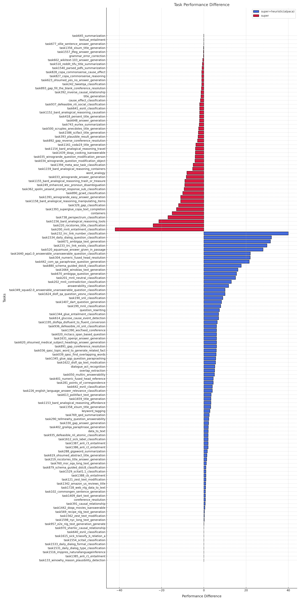

# COMP-7607-FinalProject based on Tk-Instruct

## Motivation
- At the time of the reference paper’s release in April 2022, there were yet any sizable 
datasets of a similar nature for model-development. While the paper found a linear 
growth of model performance with an increase in the number of model size, the 
available training data at the material time was relatively limited leaving a potential 
room for improvement. In response, our group plans to find and use a larger and more 
representative dataset as a form of input ablation variant and to empirically test whether 
training the baseline model with different dataset(s) could lead to improvement on the 
model’s generalization capacity and to analyse the results further for insights2
- Our preliminary research also reveals numerous compelling studies that address the 
same problem (i.e. task diversity) with the use of prompt methods and data 
augmentation techniques. We are exploring ways to incorporate these techniques into 
the baseline model to see if they could lead to a further performance improvement. 
Regarding evaluation metrics, due to the cost of human evaluation, we intend to use 
automatic evaluation at this stage.


## Data Overview

To test only the instruction generalization ability, without the examples, we use only the ‘Definition’ to train and test models.

A task example in Super-NaturalInstructions:
```json
{
  "Contributors": [
      "Swaroop Mishra",
      "Daniel Khashabi"
  ],
  "Source": [
      "quoref"
  ],
  "URL": [
      "https://allenai.org/data/quoref"
  ],
  "Categories": [
      "Question Generation"
  ],
  "Reasoning": [],
  "Definition": [
      "In this task, you're given passages that contain mentions of names of people, places, or things. Some of these mentions refer to the same person, place, or thing. Your job is to write questions that evaluate one's understanding of such references. Good questions are expected to link pronouns (she, her, him, his, their, etc.) or other mentions to people, places, or things to which they may refer. Do not ask questions that can be answered correctly without understanding the paragraph or having multiple answers. Avoid questions that do not link phrases referring to the same entity. For each of your questions, the answer should be one or more phrases in the paragraph, and it should be unambiguous."
  ],
  "Input_language": [
      "English"
  ],
  "Output_language": [
      "English"
  ],
  "Instruction_language": [
      "English"
  ],
  "Domains": [
      "Wikipedia"
  ],
  "Positive Examples": [
      {
          "input": "Passage: Nearing London, Oliver encounters Jack Dawkins, a pickpocket more commonly known by the nickname the \"Artful Dodger\", and his sidekick, a boy of a humorous nature named Charley Bates, but Oliver's innocent and trusting nature fails to see any dishonesty in their actions. The Dodger provides Oliver with a free meal and tells him of a gentleman in London who will \"give him lodgings for nothing, and never ask for change\". Grateful for the unexpected assistance, Oliver follows the Dodger to the \"old gentleman's\" residence. In this way Oliver unwittingly falls in with an infamous Jewish criminal known as Fagin, the gentleman of whom the Artful Dodger spoke. Ensnared, Oliver lives with Fagin and his gang of juvenile pickpockets in their lair at Saffron Hill for some time, unaware of their criminal occupations. He believes they make wallets and handkerchiefs.",
          "output": "Who believes Fagin's gang make wallets and handkerchiefs?.",
          "explanation": "This question is based on the following sentence in the passage \"He believes they make wallets and handkerchiefs\". It evaluates the understanding that the pronoun \"he\" refers to name \"Oliver\". You can ask questions like this one about most pronouns in a paragraph."
      },
      ...
  ],
  "Negative Examples": [
      {
          "input": "Passage: In The Tangled Skein, Queen Mary is characterized as a loving woman with a strong sense of justice. The tangled skein arises from Mary's love for the fictional character Robert d'Esclade, fifth Duke of Wessex, said in this book to be the people's choice as King Consort. Wessex is chivalrous and charming, but semi-betrothed to Lady Ursula Glynde, whom he has not seen since her infancy. Wessex is repelled by the idea of having his wife thrust upon him and purposely avoids Lady Ursula. Unknown to Wessex, the Queen jealously guards him against Ursula, who is extremely beautiful. As soon as she realizes the Queen is keeping her away from Wessex, Ursula is angered. She believes she loves Wessex, for his nobility and goodness, and she is invested heavily in the betrothal. On her father's deathbed, Ursula promised to go into a convent if she did not marry Wessex. Although Ursula does not want to lose her independence by marrying, she seeks to frustrate the Queen's plans and make Wessex notice her; however, the arrival of Cardinal de Moreno, and his henchman Don Mignel, Marquis de Saurez, shifts the scene.",
          "output": "Who does Ursula promise to?.",
          "explanation": "There is only one mention of Ursula's (\"her\") father in the sentence \"On her father's deathbed, Ursula promised to go into a convent if she did not marry Wessex\". Hence, this question does not require linking two different phrases that refer to the same entity. When you write questions, it will be helpful to think about the phrases referring to entities that they link. If you cannot think of more than one such phrase, it is likely a bad question."
      },
      ...
  ],
  "Instances": [
        {
            "id": "task001-f44801d948324957abe71877d837d070",
            "input": "Passage: The earthquake swarm was noted on October 12, 2007 in the Prince George Citizen by citizen staff, three days after the earthquakes began. Scientists mentioned in the report were seismologist John Cassidy of Natural Resources Canada and volcanologist Catherine Hickson, who was part of the Geological Survey of Canada at the time. At the time of the report, scientists did not know the origin of the swarm. Seismologist John Cassidy stated, \"the depth is enough to rule out hydrothermal but it's up in the air as to whether the cause is tectonic shifts or volcanic activity. If it is volcanic there are certain characteristics that we would expect, there's a tremor-like character to it. And so we'll be looking for the types of events that we see beneath volcanoes and we'll be looking to see if they're getting closer to the surface or if they're migrating at all.\"Even if the Nazko swarm were a warning of a volcanic eruption, Hickson doubted it would turn out to be a highly explosive eruption like those that can occur in subduction-zone volcanoes. \"We're not talking about an injection of tonnes of ash many kilometers into the air like the 1980 Mount St. Helens eruption or the 1991 Mount Pinatubo eruption. We're talking about something very small, relatively localized that should have a fairly limited impact... but it'll be extremely exciting\", Hickson said. If an eruption were to occur, Hickson suggested that it would be characterized by a lava fountain that sends globs of lava 100 m (330 ft) into the air. This is similar to those that occur in Hawaii. Hickson said that a Nazko eruption could be a tourist attraction, but warned that noxious gases such as carbon dioxide and sulfur dioxide would be released during the event.",
            "output": [
                "What is the first name of the person who doubted it would turn out to be a highly explosive eruption like those that can occur in subduction-zone volcanoes?"
            ]
        },
        ...
    ],
  "Instance License": [
      "CC BY 4.0"
  ]
}
```

## Integrating Alpaca

We refer [Exploring Format Consistency for Instruction Tuning](https://arxiv.org/abs/2307.15504) and use heuristic method introduced in this work to integrate Alpaca into Super-NaturalInstructions.

## Training Examples

The prompt that tk-instruct use in definition-only is:

```txt
Definition : {{definition}}

Now complete the following example−
input : {{x.input}}
output :
```

and an example from alpaca is:
```json
{
    "instruction": "Give three tips for staying healthy.",
    "input": "",
    "output": "1.Eat a balanced diet and make sure to include plenty of fruits and vegetables. \n2. Exercise regularly to keep your body active and strong. \n3. Get enough sleep and maintain a consistent sleep schedule."
}
```

so the training examples from alpaca would look like:
```txt
Definition : Give three tips for staying healthy.

Now complete the following example−
input :
output :
```

and the target is:
```txt
1.Eat a balanced diet and make sure to include plenty of fruits and vegetables. \n2. Exercise regularly to keep your body active and strong. \n3. Get enough sleep and maintain a consistent sleep schedule.
```

## Main Results

The results are as follows:

| Dataset                       | EM    | ROUGE-L |
|-------------------------------|-------|---------|
| super(paper)                  | ?     | 45      |
| super(reproduce)              | 28.25 | 46.21   |
| super+raw(alpaca)             | 27.65 | 45.89   |
| super+heuristic(alpaca)       | 28.67 | 47.9    |
| super+heuristic(promptsource) | 33.02 | 49.78   |

Task performance difference between super(reproduce) and super+heuristic(alpaca):

<br>
<div align="center">

</div>
<br>

### In-depth Analysis on Super+heuristic(alpaca) Model
- Common sense reasoning:

In Task 102, the objective is to generate a sentence describing a day-to-day scene using all concepts from a given concept set. The concepts are provided in sets of three to five, separated by "#". This task assesses the ability of models to create coherent and logical sentences from a set of unrelated concepts.

#### Comparison of Models
Models are trained on two types of datasets: Super-Natural Datasets and Alpaca Datasets. The analysis shows that models trained on both datasets outperform those trained solely on Super-Natural Datasets.

#### Instances Analysis

| Task Name | Task Definition & Task Input | Model | Prediction |
|-----------|------------------------------|-------|------------|
| Skier Scenario | Input: skier#slope#way | Super-Natural Dataset Model | Output: skier on the slopes way |
| Book and Shelf Scenario | Input: book#shelf#stand | Super-Natural Dataset Model | Output: books stand on a shelf |
| Beach Scenario | Input: beach#collect#shell | Super-Natural Dataset Model | Output: beach collecting shells |
| Skier Scenario Enhanced | Input: skier#slope#way | Super+Alpaca Dataset Model | Output: skier skis down the slope |
| Book and Shelf Scenario Enhanced | Input: book#shelf#stand | Super+Alpaca Dataset Model | Output: book shelf stands on a table |
| Beach Scenario Enhanced | Input: beach#collect#shell | Super+Alpaca Dataset Model | Output: beach goers collect shells |

- Models trained only on Super-Natural Datasets tend to create sentences by merely combining the given concepts without depicting the scene accurately or establishing logical relationships.
- In contrast, models trained on both Super-Natural and Alpaca Datasets generate more realistic and contextually appropriate sentences, demonstrating a better understanding of everyday scenarios and logical relationships between concepts.

#### Conclusion
The performance difference between the two models is attributed to the inclusion of Alpaca Datasets, which provide more context and common sense to the training process. Models trained on both datasets are better at applying human-like common sense and detailed understanding to the task, resulting in more realistic and coherent sentences.

- Halucination problems:


##
*For how to run the codes, refer to original [TK-instruct repo](https://github.com/yizhongw/Tk-Instruct/tree/main), .*


## Citation

```bib
@inproceedings{supernaturalinstructions,
  title={Super-NaturalInstructions:Generalization via Declarative Instructions on 1600+ Tasks},
  author={Wang, Yizhong and Mishra, Swaroop and Alipoormolabashi, Pegah and Kordi, Yeganeh and Mirzaei, Amirreza and Arunkumar, Anjana and Ashok, Arjun and Dhanasekaran, Arut Selvan and Naik, Atharva and Stap, David and others},
  booktitle={EMNLP},
  year={2022}
}

@article{wang2022self,
  title={Self-instruct: Aligning language model with self generated instructions},
  author={Wang, Yizhong and Kordi, Yeganeh and Mishra, Swaroop and Liu, Alisa and Smith, Noah A and Khashabi, Daniel and Hajishirzi, Hannaneh},
  journal={arXiv preprint arXiv:2212.10560},
  year={2022}
}

@article{mishra2021cross,
  title={Cross-task generalization via natural language crowdsourcing instructions},
  author={Mishra, Swaroop and Khashabi, Daniel and Baral, Chitta and Hajishirzi, Hannaneh},
  journal={arXiv preprint arXiv:2104.08773},
  year={2021}
}

@article{longpre2023flan,
  title={The flan collection: Designing data and methods for effective instruction tuning},
  author={Longpre, Shayne and Hou, Le and Vu, Tu and Webson, Albert and Chung, Hyung Won and Tay, Yi and Zhou, Denny and Le, Quoc V and Zoph, Barret and Wei, Jason and others},
  journal={arXiv preprint arXiv:2301.13688},
  year={2023}
}

@article{liang2023exploring,
  title={Exploring format consistency for instruction tuning},
  author={Liang, Shihao and Zhu, Kunlun and Tian, Runchu and Qin, Yujia and Wang, Huadong and Cong, Xin and Liu, Zhiyuan and Liu, Xiaojiang and Sun, Maosong},
  journal={arXiv preprint arXiv:2307.15504},
  year={2023}
}
```
